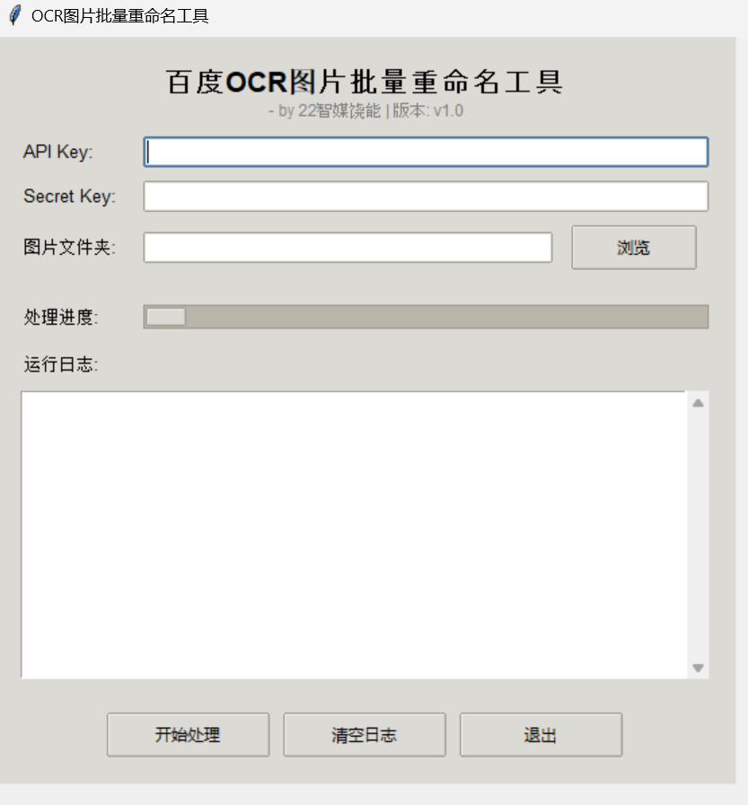
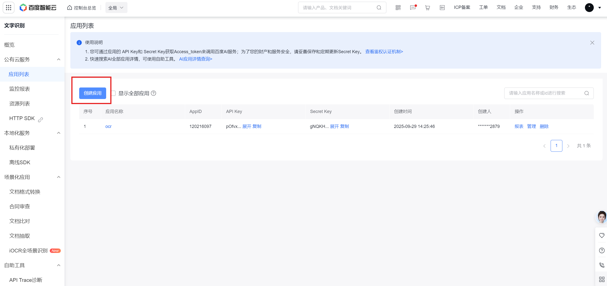
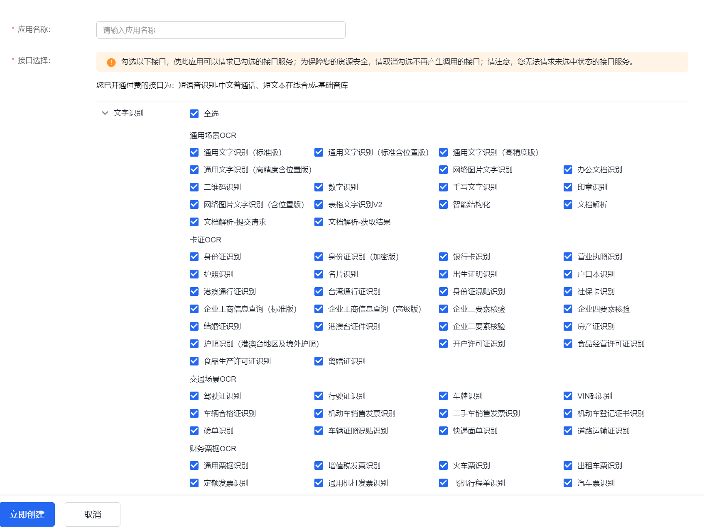

# 百度 OCR 批量重命名工具

一个基于 GUI 的图片批量重命名工具，利用百度 OCR 自动识别姓名并重命名图片文件。


## 功能特点
- 批量重命名 JPG、JPEG、PNG 图片
- 使用百度 OCR 自动识别姓名
- 自动处理重复姓名（添加 `_1`、`_2` 后缀）
- 简单易用的图形界面（Tkinter）
- 支持直接运行 Python 脚本或使用打包的 exe 文件

---

## 系统要求
- Python 3.8 及以上（仅 Python 运行模式）
- `requests` 库
- `tkinter`（Python 自带）
- `base64`（Python 自带）

---

## 安装与运行

### 方式一： exe 文件运行
1. 找到 dist  文件夹
2. 双击 main.exe 打开工具

### 方式二：Python 脚本运行
1. 克隆仓库：
   ```bash
   git clone https://github.com/raoneng26/baidu-ocr-batch-rename.git

2. 安装依赖：
   ```bash
    pip install requests

3. 运行工具：
   ```bash
    python main.py

## 获取百度 API Key
1. 打开 百度 AI 开放平台(https://console.bce.baidu.com/ai-engine/old/#/ai/ocr/app/list)， 登录或注册账号

2. 进入 控制台 → 我的应用 → 创建应用


3. 选择 OCR 产品类型，完成应用创建


4. 创建成功后，会看到 API Key 和 Secret Key


5. 将 Key 填入工具 GUI 或 Python 脚本对应输入框


⚠️ 请确保 OCR 服务已激活，否则 API Key 无法使用

---

## 使用说明
1. 打开工具（Python 脚本或 exe）
2. 输入你的 API Key 和 Secret Key
3. 选择包含图片的文件夹
4. 点击 运行
5. 图片将根据识别出的姓名重命名：
    无法识别的图片会被命名为 未识别_1、未识别_2 等
    重复姓名会自动添加 _1、_2 后缀

---

## 注意事项
    请在运行前备份图片，重命名可能会直接覆盖原文件
    仅支持 JPG、JPEG、PNG 格式
    GUI 依赖 Tkinter（Python 自带，无需额外安装）
